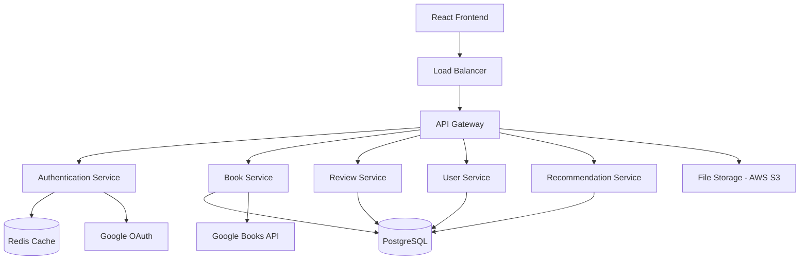

# Design Document

## Overview

The book review platform will be built as a modern web application using a microservices-oriented architecture with a React frontend and Node.js/Express backend. The system will leverage PostgreSQL for primary data storage, Redis for caching and session management, and integrate with Google Books API for book metadata. The architecture prioritizes scalability, maintainability, and user experience.

## Architecture

### High-Level Architecture



### Technology Stack

**Frontend:**
- React 18 with TypeScript
- React Router for navigation
- React Query for state management and API caching
- Tailwind CSS for styling
- Vite for build tooling

**Backend:**
- Node.js with Express.js
- TypeScript for type safety
- JWT for authentication tokens
- Passport.js for OAuth integration
- Joi for request validation
- Winston for logging

**Database & Storage:**
- PostgreSQL for primary data storage
- Redis for session management and caching
- AWS S3 for file storage (book covers, user avatars)

**External Services:**
- Google Books API for book metadata
- Google OAuth for authentication
- SendGrid for email notifications

## Components and Interfaces

### Frontend Components

#### Authentication Components
- `LoginForm`: Handles email/password and Google OAuth login
- `RegisterForm`: User registration with email verification
- `ProtectedRoute`: Route wrapper for authenticated users
- `AuthProvider`: Context provider for authentication state

#### Book Components
- `BookSearch`: Search interface with filters and suggestions
- `BookCard`: Reusable book display component
- `BookDetail`: Comprehensive book information page
- `BookList`: Paginated list of books with sorting options

#### Review Components
- `ReviewForm`: Create/edit review interface with rating system
- `ReviewCard`: Individual review display with user info
- `ReviewList`: Paginated reviews with sorting and filtering
- `CommentSection`: Nested comments with reply functionality

#### User Components
- `UserProfile`: Public user profile with reading statistics
- `ReadingLists`: Manage want-to-read, currently-reading, read lists
- `UserSettings`: Account settings and privacy controls
- `Dashboard`: Personalized user dashboard with recommendations

### Backend Services

#### Authentication Service
```typescript
interface AuthService {
  register(userData: RegisterData): Promise<User>
  login(credentials: LoginCredentials): Promise<AuthResult>
  googleOAuth(token: string): Promise<AuthResult>
  verifyToken(token: string): Promise<User>
  refreshToken(refreshToken: string): Promise<AuthResult>
  resetPassword(email: string): Promise<void>
}
```

#### Book Service
```typescript
interface BookService {
  searchBooks(query: SearchQuery): Promise<BookSearchResult>
  getBookById(id: string): Promise<Book>
  getBookDetails(isbn: string): Promise<BookDetails>
  addBook(bookData: BookData): Promise<Book>
  updateBook(id: string, updates: Partial<Book>): Promise<Book>
}
```

#### Review Service
```typescript
interface ReviewService {
  createReview(reviewData: CreateReviewData): Promise<Review>
  updateReview(id: string, updates: Partial<Review>): Promise<Review>
  deleteReview(id: string): Promise<void>
  getReviewsByBook(bookId: string, pagination: Pagination): Promise<ReviewList>
  getReviewsByUser(userId: string, pagination: Pagination): Promise<ReviewList>
  addComment(reviewId: string, commentData: CommentData): Promise<Comment>
}
```

#### User Service
```typescript
interface UserService {
  getUserProfile(id: string): Promise<UserProfile>
  updateProfile(id: string, updates: ProfileUpdates): Promise<UserProfile>
  addToReadingList(userId: string, bookId: string, status: ReadingStatus): Promise<void>
  getReadingList(userId: string, status: ReadingStatus): Promise<BookList>
  followUser(followerId: string, followeeId: string): Promise<void>
  getFollowers(userId: string): Promise<UserList>
}
```

## Data Models

### User Model
```typescript
interface User {
  id: string
  email: string
  username: string
  displayName: string
  avatar?: string
  bio?: string
  isEmailVerified: boolean
  googleId?: string
  createdAt: Date
  updatedAt: Date
  privacySettings: PrivacySettings
}

interface PrivacySettings {
  profileVisibility: 'public' | 'private'
  showReadingActivity: boolean
  showReviews: boolean
  allowFollowers: boolean
}
```

### Book Model
```typescript
interface Book {
  id: string
  isbn: string
  title: string
  authors: string[]
  description: string
  publishedDate: Date
  publisher: string
  pageCount: number
  categories: string[]
  coverImage: string
  averageRating: number
  ratingsCount: number
  googleBooksId?: string
  createdAt: Date
  updatedAt: Date
}
```

### Review Model
```typescript
interface Review {
  id: string
  userId: string
  bookId: string
  rating: number // 1-5
  title: string
  content: string
  spoilerWarning: boolean
  likesCount: number
  commentsCount: number
  createdAt: Date
  updatedAt: Date
}
```

### Comment Model
```typescript
interface Comment {
  id: string
  reviewId: string
  userId: string
  content: string
  parentCommentId?: string // for nested replies
  likesCount: number
  createdAt: Date
  updatedAt: Date
}
```

### Reading List Model
```typescript
interface ReadingListEntry {
  id: string
  userId: string
  bookId: string
  status: 'want-to-read' | 'currently-reading' | 'read'
  dateAdded: Date
  dateStarted?: Date
  dateFinished?: Date
  progress?: number // percentage for currently reading
}
```

## Error Handling

### Error Response Format
```typescript
interface ErrorResponse {
  success: false
  error: {
    code: string
    message: string
    details?: any
  }
  timestamp: string
  path: string
}
```

### Error Categories
- **Authentication Errors** (401): Invalid credentials, expired tokens
- **Authorization Errors** (403): Insufficient permissions
- **Validation Errors** (400): Invalid input data, missing required fields
- **Not Found Errors** (404): Resource not found
- **Rate Limiting Errors** (429): Too many requests
- **Server Errors** (500): Database errors, external API failures

### Error Handling Strategy
- Global error middleware for consistent error responses
- Client-side error boundaries for React components
- Retry logic for external API calls
- Graceful degradation for non-critical features
- Comprehensive logging for debugging and monitoring

## Testing Strategy

### Frontend Testing
- **Unit Tests**: Jest and React Testing Library for components
- **Integration Tests**: Testing user flows and API integration
- **E2E Tests**: Cypress for critical user journeys
- **Visual Regression Tests**: Chromatic for UI consistency

### Backend Testing
- **Unit Tests**: Jest for service layer and utilities
- **Integration Tests**: Supertest for API endpoints
- **Database Tests**: Test database with fixtures and cleanup
- **Contract Tests**: Ensure API contract compliance

### Test Coverage Goals
- Minimum 80% code coverage for critical paths
- 100% coverage for authentication and security features
- Performance testing for search and recommendation features
- Load testing for concurrent user scenarios

### Testing Environment
- Separate test databases with seed data
- Mock external APIs (Google Books, OAuth)
- Automated testing in CI/CD pipeline
- Staging environment for manual testing

## Security Considerations

### Authentication & Authorization
- JWT tokens with short expiration times
- Refresh token rotation
- Rate limiting on authentication endpoints
- Password hashing with bcrypt
- OAuth 2.0 implementation following security best practices

### Data Protection
- Input validation and sanitization
- SQL injection prevention with parameterized queries
- XSS protection with content security policies
- HTTPS enforcement
- Secure cookie settings

### Privacy & Compliance
- User data encryption at rest
- GDPR compliance for data export/deletion
- Privacy settings enforcement
- Audit logging for sensitive operations
- Regular security assessments

## Performance Optimization

### Caching Strategy
- Redis for session storage and frequently accessed data
- Browser caching for static assets
- API response caching for book metadata
- Database query optimization with indexes

### Database Optimization
- Proper indexing on search fields
- Connection pooling
- Read replicas for scaling
- Query optimization and monitoring

### Frontend Performance
- Code splitting and lazy loading
- Image optimization and CDN usage
- Bundle size optimization
- Progressive Web App features

### Scalability Considerations
- Horizontal scaling with load balancers
- Microservices architecture for independent scaling
- Database sharding strategies for large datasets
- CDN for global content delivery